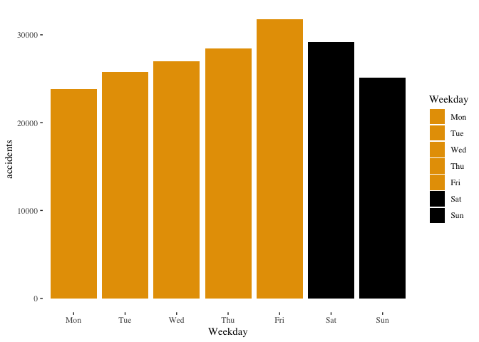

This is the easy read version with the code hidden, to see the R code you want [README.Rmd](The Rmarkdown version)

In 2018, Chris Knox from the New Zealand Herald made available the data results from an Official Information Act request for every road accident in New Zealand from the year 2000 grouped by hour of the day and severity of the accident[^1].

Of the 672410 accidents, the data set is incomplete after mid-August 2018. This shows up in the percentage variation severity of entries over time. As I am using severity in this analysis and weekly aggregations, I am excluding entries more recent than August 2018. 

Because Non-injury accidents may potentially be under reported generally, I am also choosing to focus only on death and injury accidents. As hour of the day is import in this analysis, I am also excluding those entries that the hour of the accident was unknown.

By determining the day of the week of accidents, and also using the hour of day, we can observe the overall weekly pattern of accidents.

This weekday rising trend is also present within days. As road activity varies through the day, for days with an evening commute (so we are comparing like with like), we can express the number of accidents in each hour as a percentage of the Monday accidents for that hour.

This is a highly regular pattern of the later in the day and the later in the week, the more accidents. 

## But what about...

The main criticism that can be made is that this is just based on accidents, and different levels of traffic on different days could be creating a relationship where there is not one. This is a traditional criticism that stops debate around fatigue from progressing.

But, there are several different ways of addressing this criticism.

### Consider traffic density irrelevant

We could just assume that the density of traffic does not matter, only the time of the observation (as a measure of fatigue relative to the start of the week). This is the baseline case calculated above, so the data does not need any additional calculation.

But, clearly, for the people making the criticism "Nope" is not a sufficient response.

### Relative to known traffic numbers

"By Hour" traffic volumes are not commonly available. However, one source that is available is by day of week and hour of day traffic volumes for the Auckland Harbour Bridge [^2], a natural funnel point for traffic. Using this makes the two assumptions that the daily patterns of the Auckland Harbour Bridge are broadly representative of other locations, and that normalising the accident data with number of cars is a useful thing to do.

Formally, the assumptions in this model are that number of vehicles on the road is significant, and that Auckland Harbour Bridge traffic patterns are a reasonable proxy for general national traffic.

Regardless of if normalising in this fashion is actually useful thing to do, the overall pattern of rising through the week is similar to the unadjusted figures. It is less clear in the within day pattern, lending evidence to either in day variation being less significant than first indicated, or the Auckland Harbour Bridge maybe be a poor model for the entire country in the finer details while being a pretty good model in the big picture.

### Relative to daily traffic numbers

While "by hour" traffic volumes are not available for the country, rather than using traffic volumes from a specific site, I can build a model based on daily traffic flow. With the idea that commuting traffic is a return journey, rather than a one way buying then abandoning cars, the volume of the evening commute should relate to the volume of the morning commute. For each day of the week, way can express the volume of traffic in the evening commute hours as per the volume of the morning commute. 

However, as well as normalising for amount of traffic on the day, this also potentially normalises for some of the fatigue variation within the week. To the extent to which a day's morning commute has accidents caused by weekly work fatigue, normalising with the morning commute will cancel fatigue in the evening commute data.

Formally, the assumptions in this model are that number of vehicles on the road is reflected in the number of accidents, that the volume of the morning commute relates to the volume of the afternoon commute, and that the day of the week is significant.

With this normalisation of the data, there is still a rising trend through the week (despite some of the rise potentially being cancelled by the normalisation), and the within-day pattern of rises being greater for hours later in the day is restored. The pattern looks almost rotational with respect to Monday, which could be explained as some kind of curved relationship, where the benefit of overnight sleep less effective through the week.

### The clever way

Rather than normalising against the morning commute of the same day, we can take advantage of the way each aggregate day is made up of near to one thousand individual days that add up to a cumulative level of morning commute accidents. We can randomly sample days from the entire week until we get to the same level off accidents as a day of the week, and see what the evening commute level of accidents for a "typical" day with that level of morning activity. If I repeat the random accumulation ten thousand times, I can build a very accurate estimate of a typical day.

For this approach, the formal assumptions are that number of vehicles on the road is reflected in the number of accidents, and that the volume of the morning commute relates to the volume of the afternoon commute.

If you are of the opinion that fatigue is increasing through the week, and that fatigue is being captured in this data, then a typical day would expect to best match a midweek period. If the rise through the week is not a similar linear (straight) line for each hour of the day, then some stretching of the scale might be seen by the start and end of the week relative to the middle.

Random sampling to construct a typical day also offers a way of expressing the uncertainty range of the results, by checking the range of the randomly accumulated values.

It turns out that the elaborate day-neutral model has the same pattern as the morning rush of the day model, expect perhaps a very slightly clearer division between the evening hours. This suggests the morning rush is not particularly sensitive to the weekly fatigue pattern. Which given the data has shown the accident rate rising through the end of day period, suggests a nights rest is acting as a partial reset to weekly fatigue that wears off through the day.

From a "my key point is" perspective, there is still a profound weekly pattern not cancelled out by normalising the data against possible daily activity, and it is pretty-much the same pattern seen however the data has been adjusted.

## Excess accidents

Since we have a stable general pattern, I can take that pattern and express the data in terms of the excess number of death and injury accidents. But this involves some assumptions about what we mean by excess. I am assuming when you are well rested from limited work hours, accidents beyond the minimum are excess (*cough* Sweden *cough*). 

Based on the raw numbers, without any attempt to adjust for traffic volumes, compared to the lowest day in each hour (so ignoring the increase through the day) there is a excess of 6970 accidents due to work-week daily variation.

Based on the normalised numbers, making a best possible attempt to adjust for traffic volumes, compared to the lowest day in each hour (so ignoring the increase through the day) there is a median excess of 5201 accidents due to work-week daily variation (with a 95% interval of 4461 to 5999 accidents).

This means, with 49730 accidents, this is around 14% for the raw values, or 9% to 12.1% for the vehicle volume adjusted model, are caused by weekly fatigue patterns.

## Some Thoughts

* These estimates, because they are not including the increase in accidents through the day, only through the week, these are a low estimate.
* It seems impossible to get to Sweden's road/death levels without Sweden's work/life levels.
* There is a lot more can be done with this approach.

[^1]: New Zealand Herald/ Chris Knox. Official Information Act response of number of accidents by hour of day and date. crashes by severity and hour.csv (2019) From https://github.com/nzherald/crashes-2018/tree/master/data retrieved 16 June 2019

[^2]: Matt Lowrie. Breaking down Harbour Bridge volumes(2015) https://www.greaterauckland.org.nz/2015/05/19/breaking-down-harbour-bridge-volumes/ May 19, 2015

